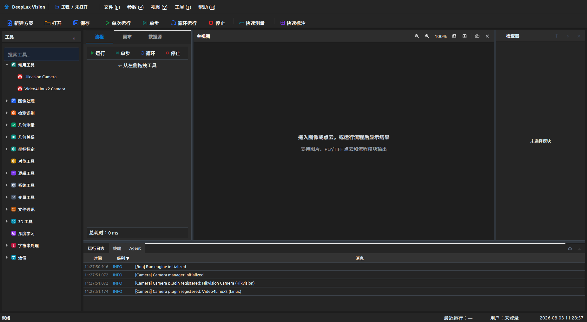
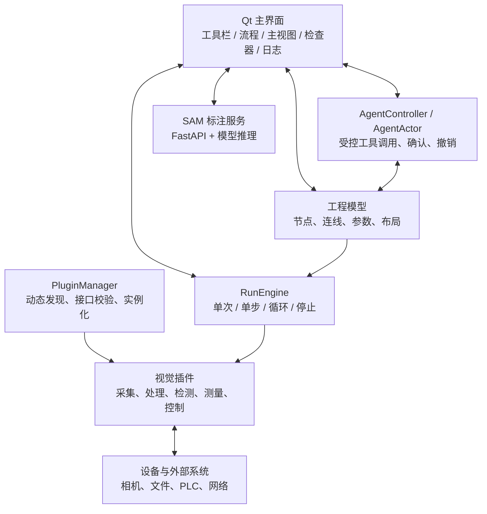
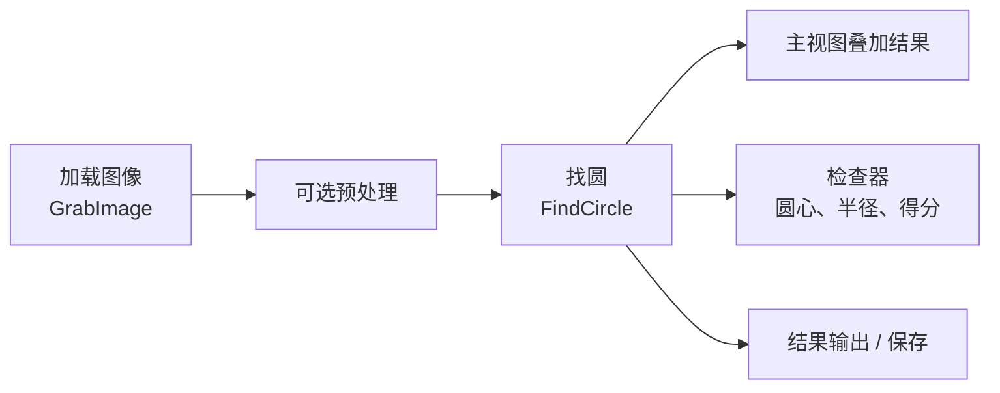

# DeepLux Vision

DeepLux Vision 是面向工业现场的跨平台机器视觉软件。它以可视化流程组织采集、预处理、检测、测量、控制和结果输出；算法能力以动态插件交付，工程师可在同一界面配置参数、单步检查中间结果并追踪运行日志。



## 核心能力

| 能力 | 说明 |
| --- | --- |
| 可视化流程 | 从工具栏添加模块，连接数据流，并在流程画布中查看节点状态与单节点耗时。 |
| 可控执行 | 支持单次运行、单步运行、循环运行和停止；单步只执行当前节点，便于检查中间结果。 |
| 结果检视 | 主视图显示图像、点云和检测叠加，右侧检查器展示参数、模块信息和运行结果。 |
| 插件扩展 | 图像处理、检测识别、几何测量、标定、逻辑、通信、变量、3D 和相机插件按需加载。 |
| 2D/3D 数据 | 流程可处理图像与点云；相应模块在主视图中呈现输出和测量结果。 |
| Agent 协作 | Agent 可读取工程状态、创建或调整流程，并通过受控工具调用执行可审计操作。 |
| SAM 快速标注 | 在主视图中通过正点、负点和框选生成掩膜预览，支持会话保存及 LabelMe/YOLO 分割导出。 |

## 架构概览



完整边界、数据流和扩展点见 [架构说明](docs/architecture.md)。

## 快速开始

### 1. 准备环境

- CMake 3.16+
- C++17 编译器
- Qt 6.6+，或 Qt 5.15.3+；需包含 `Core`、`Gui`、`Widgets`、`Network`、`Sql`、`Test`、`Concurrent` 和 `SerialPort`
- 可选：OpenCV、Basler Pylon、海康 MVS 等相机 SDK
- 按需：Halcon Runtime 21.11+。当前默认构建不强制链接 Halcon；接入相关插件或 SDK 时才需要。

### 2. 配置并编译

Linux：

```bash
cmake -S . -B build -DDEEPLUX_QT_PATH=/path/to/Qt/6.6.0/gcc_64 -DBUILD_TESTS=ON
cmake --build build -j$(nproc)
```

Windows（Visual Studio 2022）：

```bat
cmake -S . -B build -G "Visual Studio 17 2022" -A x64 ^
  -DCMAKE_PREFIX_PATH=C:/Qt/6.6.0/msvc2019_64 -DBUILD_TESTS=ON
cmake --build build --config Release
```

可用 CMake 选项：`-DUSE_QT6=ON|OFF`、`-DENABLE_CAMERA_BASLER=ON`、`-DENABLE_CAMERA_HIKVISION=ON`。

### 3. 同步插件并启动

```bash
cmake --build build --target sync-plugins
./build/bin/DeepLux --gui
```

`sync-plugins` 会把已构建的插件同步到 `~/.deeplux/plugins`，用于验证运行时插件加载。命令行能力见 [CLI 文档](docs/cli.md)。

## 典型流程：从图像到找圆结果



1. 新建工程，在工具栏中添加 `GrabImage`、`FindCircle` 和一个结果输出模块。
2. 在画布中按数据流连接模块；选中模块后，在右侧检查器设置参数。
3. 将 `GrabImage` 的**图像源**设为“文件”，填写**文件路径**；也可切换到相机或演示输入。
4. 为 `FindCircle` 设置**最小半径**、**最大半径**、**Canny 高阈值**和**累加器阈值**。
5. 使用“单步”逐节点查看输出，或使用“运行”执行整个流程。成功后，检查器显示圆心、半径和得分，主视图显示叠加结果。

更完整的操作、排查和验收步骤见 [快速上手](docs/quick-start.md)。

## Agent 与 SAM 标注

- **Agent**：主入口位于底部“Agent 对话”页。Agent 仅能调用已声明的内部工具，写操作经过权限、确认和撤销链路，不具备任意 shell 执行权限。详见 [终端与 Agent 设计](docs/Terminal_Agent_Design.md)。
- **SAM 标注**：从顶部“快速标注”打开配置面板，在主视图选择正点、负点或框选以预览掩膜。首次使用需要在面板中初始化 Python 环境并导入兼容的 SAM 权重；模型运行在独立 FastAPI 进程中，不污染 C++ 构建环境。

## 项目结构

```text
.
├── src/
│   ├── app/                 # 应用入口
│   ├── core/                # 工程模型、执行引擎、插件/设备/Agent 服务
│   ├── ui/                  # Qt 主界面、面板、视图、对话框
│   └── plugins/<domain>/    # 按领域组织的动态插件
├── tools/sam_server/        # SAM FastAPI 运行时
├── tests/                   # Qt Test 单元和界面行为测试
├── docs/                    # 使用、设计和报告文档
├── cmake/                   # CMake 查找与构建辅助模块
└── scripts/                 # 本地构建、同步和 CLI 辅助脚本
```

## 文档索引

| 文档 | 内容 |
| --- | --- |
| [快速上手](docs/quick-start.md) | 创建找圆流程、单步检查、常见排查。 |
| [架构说明](docs/architecture.md) | UI、工程、执行引擎、插件、Agent 与 SAM 的职责边界。 |
| [插件手册](docs/plugins.md) | 59 个运行时插件的用途、接入方式、关键配置和结果说明。 |
| [CLI 文档](docs/cli.md) | GUI 之外的项目、模块与连接管理命令。 |
| [终端与 Agent 设计](docs/Terminal_Agent_Design.md) | 受控 Agent 工具调用、审计与权限模型。 |
| [工程技能图谱](docs/skills/README.md) | UI、插件、测量、流程、Agent、SAM 与质量验证的可复用方法。 |
| [3D 设计文档](docs/design/) | 点云渲染、LOD 和相关设计记录。 |

## 开发与验证

```bash
ctest --test-dir build --output-on-failure
cmake --build build --target sync-plugins
```

插件位于 `src/plugins/<domain>/<PluginName>/`，通常包含 `CMakeLists.txt`、`metadata.json` 和 `*Plugin.{h,cpp}`。参数编辑器、范围和结果字段由 `metadata.json` 描述；新增插件或修改接口后，应完整重建并同步插件，避免主程序与插件接口版本不一致。

贡献约定、代码风格和测试要求见 [AGENTS.md](AGENTS.md)。

## 许可证

当前仓库未附带许可证文件。使用、分发或二次开发前，请与项目维护方确认授权范围。
