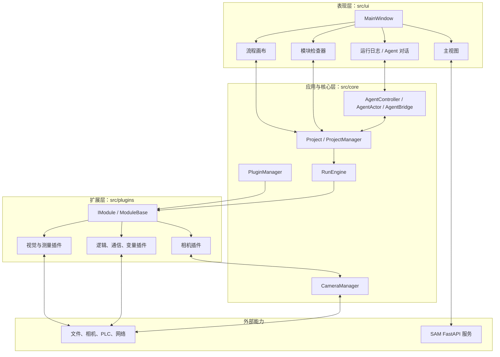
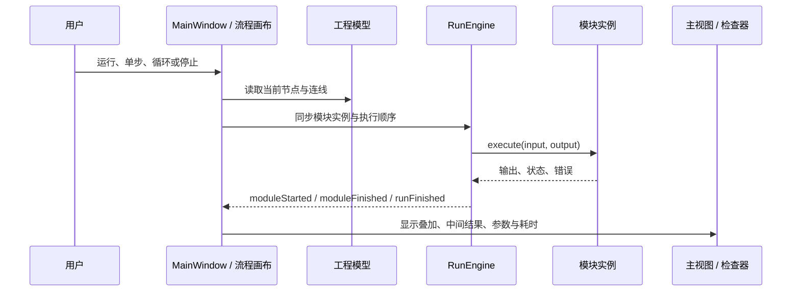
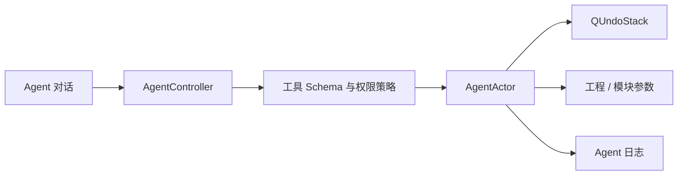
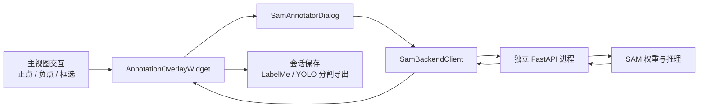

# DeepLux 架构说明

本文说明 DeepLux 的运行时边界。目标是让视觉流程、插件、设备接入和 AI 能力可以分别演进，同时保持工程可保存、运行可追踪、写操作可审计。

## 分层与职责



| 层 | 主要职责 | 不承担的职责 |
| --- | --- | --- |
| UI | 组织工作区、编辑工程、显示中间结果、发起执行和展示状态。 | 不直接实现算法或管理插件生命周期。 |
| 工程模型 | 保存模块实例、连线、布局和参数。 | 不执行视觉算法。 |
| RunEngine | 根据工程顺序运行模块，管理运行状态、单步、循环、停止、输出和耗时。 | 不渲染 UI，也不解析插件配置页面。 |
| PluginManager | 发现动态库、校验接口版本、读取元数据并创建独立模块实例。 | 不保存工程或决定业务流程。 |
| 插件 | 处理一个明确的视觉、测量、控制或通信职责，声明参数和结果。 | 不直接修改主窗口或其他插件的私有状态。 |

## 流程执行与结果回传



- **运行**执行当前工程一次。
- **单步**仅推进一个模块，并保留当前输出供主视图和检查器查看。
- **循环**按周期重复运行；不需要调试会话，因此不会为每个循环额外创建检查断点。
- **停止**向执行引擎发出停止和取消请求，流程修改前会先脱离引擎持有的模块指针。

## 插件契约

每个可实例化插件实现 `IModule`，并由 `metadata.json` 提供界面描述。该契约包含：

- 基本身份：模块 ID、名称、分类、版本、图标和描述。
- 生命周期：初始化、关闭和状态。
- 算法入口：`execute(const ImageData& input, ImageData& output)`。
- 参数：默认值、当前值、单项设置、批量校验和序列化。
- 配置：可选的高级配置页面，以及由元数据生成的通用检查器控件。
- 兼容性：接口版本不匹配的插件会被拒绝加载，避免主程序与插件虚表不一致。

模块实例不能共享模板状态。工程中的每个节点均由插件模板克隆而来，参数、显示名称和运行数据相互独立。

## Agent 边界

Agent 的 UI 入口是底部“Agent 对话”页，审计入口是“Agent 日志”页。其调用路径为：



- Agent 只能调用注册的内部工具，例如读取流程、添加模块和设置参数。
- 写操作按照权限等级执行确认；可撤销操作通过 `QUndoStack` 管理。
- `AgentBridge` 提供结构化 IPC 协议中的 `tool_call`、`query`、`subscribe` 和 `ping`。
- 任意 shell `execute` 请求被明确拒绝。真实终端仅供人类用户和 CLI 使用，不能成为 Agent 的通用执行通道。

详细协议与权限策略见 [终端与 Agent 设计](Terminal_Agent_Design.md)。

## SAM 快速标注边界

SAM 标注是主视图上的交互能力，而不是普通流程插件：标注需要用户反复添加正点、负点或框选，并即时查看掩膜预览。



- `HImageWidget` 负责图像显示、缩放和坐标变换；标注叠加层独立维护掩膜、多边形和提示点，避免与测量叠加混杂。
- `SamBackendClient` 管理后端进程和 HTTP 请求。后端按图像缓存 embedding，后续提示点预测复用同一 embedding。
- Python 依赖和模型权重与 C++ 构建隔离。首次使用通过标注面板初始化环境并导入权重；模型文件不应提交到仓库。

## 验证边界

核心改动的最低验证集应覆盖：

```bash
cmake --build build -j$(nproc)
ctest --test-dir build --output-on-failure
cmake --build build --target sync-plugins
```

界面变更还应在 GUI 中检查流程、主视图、检查器和底部日志的联动；插件接口或元数据变更还应验证插件重建和运行时加载。
