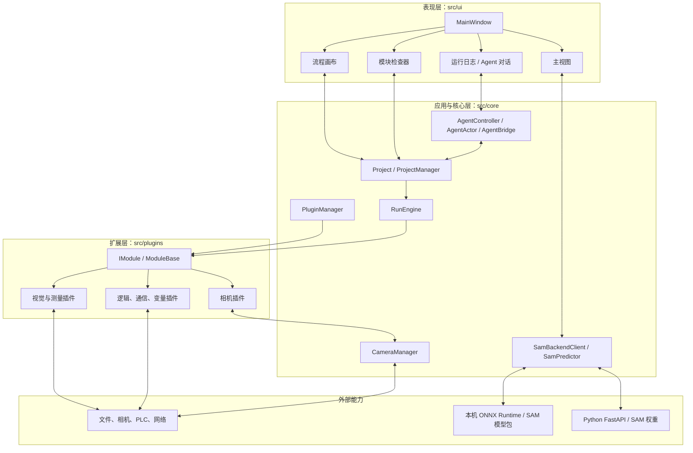
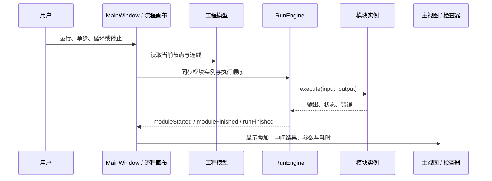
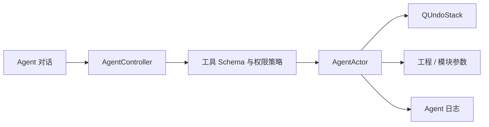
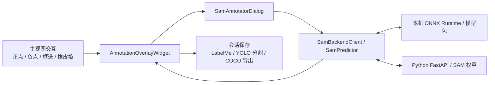

# DeepLux 架构说明

本文说明 DeepLux 的运行时边界。目标是让视觉流程、插件、设备接入和 AI 能力可以分别演进，同时保持工程可保存、运行可追踪、写操作可审计。

## 分层与职责


```mermaid
flowchart TB
    subgraph Presentation[表现层：src/ui]
        MW[MainWindow]
        Canvas[流程画布]
        Viewport[主视图]
        Inspector[模块检查器]
        Log[运行日志 / Agent 对话]
    end

    subgraph Application[应用与核心层：src/core]
        Project[Project / ProjectManager]
        Engine[RunEngine]
        PM[PluginManager]
        Agent[AgentController / AgentActor / AgentBridge]
        Device[CameraManager]
        SamClient[SamBackendClient / SamPredictor]
    end

    subgraph Extensions[扩展层：src/plugins]
        Module[IModule / ModuleBase]
        Vision[视觉与测量插件]
        Control[逻辑、通信、变量插件]
        Camera[相机插件]
    end

    subgraph External[外部能力]
        IO[文件、相机、PLC、网络]
        SamNative[本机 ONNX Runtime / SAM 模型包]
        SamServer[Python FastAPI / SAM 权重]
    end

    MW --> Canvas
    MW --> Viewport
    MW --> Inspector
    MW --> Log
    Canvas <--> Project
    Inspector <--> Project
    Project --> Engine
    PM --> Module
    Engine --> Module
    Module --> Vision
    Module --> Control
    Module --> Camera
    Vision <--> IO
    Control <--> IO
    Camera <--> Device
    Device <--> IO
    Agent <--> Project
    Log <--> Agent
    Viewport <--> SamClient
    SamClient <--> SamNative
    SamClient <--> SamServer
```

| 层 | 主要职责 | 不承担的职责 |
| --- | --- | --- |
| UI | 组织工作区、编辑工程、显示中间结果、发起执行和展示状态。 | 不直接实现算法或管理插件生命周期。 |
| 工程模型 | 保存模块实例、连线、布局和参数。 | 不执行视觉算法。 |
| RunEngine | 根据工程顺序运行模块，管理运行状态、单步、循环、停止、输出和耗时。 | 不渲染 UI，也不解析插件配置页面。 |
| PluginManager | 发现动态库、校验接口版本、读取元数据并创建独立模块实例。 | 不保存工程或决定业务流程。 |
| 插件 | 处理一个明确的视觉、测量、控制或通信职责，声明参数和结果。 | 不直接修改主窗口或其他插件的私有状态。 |

## 流程执行与结果回传


```mermaid
sequenceDiagram
    participant User as 用户
    participant UI as MainWindow / 流程画布
    participant Project as 工程模型
    participant Engine as RunEngine
    participant Plugin as 模块实例
    participant View as 主视图 / 检查器

    User->>UI: 运行、单步、循环或停止
    UI->>Project: 读取当前节点与连线
    UI->>Engine: 同步模块实例与执行顺序
    Engine->>Plugin: execute(input, output)
    Plugin-->>Engine: 输出、状态、错误
    Engine-->>UI: moduleStarted / moduleFinished / runFinished
    UI->>View: 显示叠加、中间结果、参数与耗时
```

- **运行**执行当前工程一次。
- **单步**仅推进一个模块，并保留当前输出供主视图和检查器查看。
- **循环**按周期重复运行；不需要调试会话，因此不会为每个循环额外创建检查断点。
- **停止**向执行引擎发出停止和取消请求，流程修改前会先脱离引擎持有的模块指针。

## 插件契约

每个可实例化插件实现 `IModule`，并由 `metadata.json` 提供界面描述。该契约包含：

- 基本身份：模块 ID、名称、分类、版本、图标和描述。
- 生命周期：初始化、关闭和状态。
- 算法入口：`execute(const ImageData& input, ImageData& output)`。
- 参数：默认值、当前值、单项设置、批量校验和序列化。
- 配置：可选的高级配置页面，以及由元数据生成的通用检查器控件。
- 兼容性：接口版本不匹配的插件会被拒绝加载，避免主程序与插件虚表不一致。

模块实例不能共享模板状态。工程中的每个节点均由插件模板克隆而来，参数、显示名称和运行数据相互独立。

## 数据契约与端口（ABI v2）

跨模块数据一律以 `DataType` 声明（`core/deeplux/DataContract.h`），`metadata.json` 的 `ports` 声明输入/输出端口的类型、必需性与多输入语义。运行期由 `ModuleBase::execute(PortValueMap...)` 桥接层负责：

- 输入侧：按端口声明做必需性与类型校验，不匹配时返回结构化错误码（`ExecError::MissingRequiredInput` / `TypeMismatch`），不进入 `process()`。
- 输出侧：只导出 `metadata.json` 声明过的命名端口，未声明的输出不进入下游。

**兼容传输策略**：`ImageData` 作为图像载体的同时，可承载命名数据键（`setData`/`data`）；
旧式 `process(ImageData, ImageData)` 插件产出的命名数据，由桥接层按端口声明显式化为端口值。
这是 ABI v2 阶段明确的兼容传输方式，不代表"任意键都能跨模块流动"——未在 `metadata.json`
声明的键不会导出为端口。

**未实现类型在加载期拒绝**：`Mask2D`、`Ellipse2D`、`Transform2D`、`ClassScores`
尚无载荷契约与生产者插件（`Region2D` 已于 SAM 批1 落地：载荷契约 + `SamPredict`
生产者 + `RegionStats` 消费者，并由 `isSupportedPortType` 放行）。枚举值保留以维持
ABI 稳定，但 `metadata.json` 声明未落地类型会在 `PluginManager::loadPluginMetadata`
阶段被明确拒绝（错误信息指明端口与类型），避免"连接合法、运行期永远拒绝"的
悬空端口；待对应载荷与插件落地后再放开。

## Agent 边界

Agent 的 UI 入口是底部“Agent 对话”页，审计入口是“Agent 日志”页。其调用路径为：


```mermaid
flowchart LR
    Chat[Agent 对话] --> Controller[AgentController]
    Controller --> Schema[工具 Schema 与权限策略]
    Schema --> Actor[AgentActor]
    Actor --> Undo[QUndoStack]
    Actor --> Project[工程 / 模块参数]
    Actor --> Audit[Agent 日志]
```

- Agent 只能调用注册的内部工具，例如读取流程、添加模块和设置参数。
- 写操作按照权限等级执行确认；可撤销操作通过 `QUndoStack` 管理。
- `AgentBridge` 提供结构化 IPC 协议中的 `tool_call`、`query`、`subscribe` 和 `ping`。
- 任意 shell `execute` 请求被明确拒绝。真实终端仅供人类用户和 CLI 使用，不能成为 Agent 的通用执行通道。

详细协议与权限策略见 [终端与 Agent 设计](Terminal_Agent_Design.md)。

## SAM 快速标注边界

SAM 标注是主视图上的交互能力，而不是普通流程插件：标注需要用户反复添加正点、负点或框选，并即时查看掩膜预览。


```mermaid
flowchart LR
    User[主视图交互<br/>正点 / 负点 / 框选 / 橡皮擦] --> Overlay[AnnotationOverlayWidget]
    Overlay --> Dialog[SamAnnotatorDialog]
    Dialog --> Client[SamBackendClient / SamPredictor]
    Client <--> Native[本机 ONNX Runtime / 模型包]
    Client <--> Server[Python FastAPI / SAM 权重]
    Client --> Overlay
    Overlay --> Export[会话保存<br/>LabelMe / YOLO 分割 / COCO 导出]
```

- `HImageWidget` 负责图像显示、缩放和坐标变换；标注叠加层独立维护掩膜、多边形和提示点，避免与测量叠加混杂。
- `SamBackendClient` 管理 Python 服务进程和 HTTP 请求；原生路径由 C++ ONNX 推理核心执行。两条路径都可复用同图 embedding，换图后重新编码。
- 原生 SAM 默认参与编译，需在配置时提供 ONNX Runtime SDK；运行时通过标注面板选择并持久化模型包，不需要 Python。`DEEPLUX_SAM_PACKAGE` / `DEEPLUX_SAM_DEVICE` 作为部署覆盖项保留。Python 服务仍是标注面板默认后端，其依赖和权重与 C++ 构建隔离。模型文件均不应提交到仓库；CPU/CUDA 与异机部署的验证边界见[安装说明](sam_native/stage5_packaging.md)。
- 掩膜编辑算法集中在 `MaskOps`（`core/model/AnnotationMaskOps`，纯函数无 UI 依赖）：形态学膨胀/腐蚀（可分离滑窗，越界按背景）、8-连通分量、Moore 外轮廓追踪、橡皮擦笔画、多边形栅格化，以及与 sam_server `_encode_rle` 语义一致的 RLE 编解码（列主序，损坏输入失败关闭）。
- 标注对话框对已确认对象提供膨胀/腐蚀/橡皮擦/合并/拆分（SAM 批2）：编辑作用于整图尺寸二值掩膜（来源优先级：内存缓存 → maskRle → polygon 栅格化重建），完成后重导出 polygon/bbox/maskRle；每次编辑整体入撤销栈，可精确回滚。空结果、多连通分量结果（单多边形模型无法如实表达）、不连通区域的合并均失败关闭并给出状态栏提示，不静默丢像素；拆分保留最大分量的原对象身份，派生对象 score=0（非 SAM 预测，不伪造置信度）。
- Agent 工具化（SAM 批3）：`sam_predict`（单次 prompt 分割，返回 label/score/bbox/polygon JSON，不回传 RLE 本体防上下文爆炸）与 `sam_annotate`（1–16 项批量分割并追加写入 `.deeplux-anno.json` 会话，全有或全无、混图拒绝）注册进 ToolSchema 白名单，与 `SamPredict` 插件共享 `SamPredictor` 同步预测核心（栈上客户端 + 本地事件循环 + 取消轮询 + Region2D 契约门禁；批量项间经事件循环延迟发起，避免在客户端回复 settle 前重入）。权限口径：两者均非 readOnly（最小权限，Observer 拒绝）；`sam_annotate` 为 dangerous（写文件，Autopilot 也需确认）。
- 导出/导入扩展（SAM 批4）：`CocoExporter`（`core/io`）把会话导出为 COCO instances JSON——area 取值链 maskRle 前景像素数 → polygon 鞋带面积 → bbox 面积，segmentation 为展平多边形环；类别 id 1 起、参数顺序优先并按出现追加；空标注/无效宽高/空标签失败关闭；`QSaveFile` 原子写。`LabelMeImporter` 严格解析 LabelMe shapes（label 非空、points ≥2 且为有限 [x,y] 对、shape_type 缺失按点数推导），`rectangleBoxes` 仅提取非退化矩形并归一化，跳过形状计数显式报告；`sam_annotate` 增加 `labelMePath` 参数与 `items` 互斥二选一（XOR），矩形转 box prompt 批量分割。
- 多掩膜候选（SAM 批4）：sam_server `/predict` 增返 `candidates`（≤3，score 降序，`candidates[0]` 与顶层 best 字段一致，旧客户端不受影响）；`SamBackendClient` 严格解析（可选字段、上限 8、元素级失败关闭）并经 `lastCandidates()` 暴露；`SamPromptItem.candidateIndex`（0=最佳）在 `SamPredictor` 收口选择——越界、负值、后端无候选却指定 index>0 均失败关闭，`SamPredictOutcome.candidateScores` 回传各项 score 列表；对话框以 ◀/▶ 循环切换预览（candidates>1 才显示循环行），确认写入的是所选候选；`sam_predict`/`sam_annotate` 透传 `candidateIndex`（[0,7] 整数守卫）并回传 candidateCount/candidateScores 摘要供 LLM 改选。

## 验证边界

核心改动的最低验证集应覆盖：

```bash
cmake --build build -j$(nproc)
ctest --test-dir build --output-on-failure
cmake --build build --target sync-plugins
```

界面变更还应在 GUI 中检查流程、主视图、检查器和底部日志的联动；插件接口或元数据变更还应验证插件重建和运行时加载。
