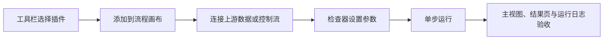

# DeepLux 插件手册

本手册覆盖 `src/plugins` 中全部 59 个带 `metadata.json` 的运行时插件。参数名称和可编辑范围以各插件的元数据为准；本文补充其在流程中的接入位置、实际使用步骤和结果检查方式。

> 运行前先执行 `cmake --build build --target sync-plugins`。相机、PLC、串口和 3D 模块还受操作系统、硬件、SDK、网络和现场权限影响，配置前应确认相应资源可用。

## 通用使用方式

- 选中流程节点后，右侧**检查器**显示参数和结果；高级配置页和检查器编辑的是同一模块实例。
- 图像、点云和计算结果通过流程管道传递。多数视觉插件保留输入数据并附加结果键，选择节点后可在检查器和主视图查看。
- “单步”适合定位输入、参数或连接问题；“循环”适合已稳定的在线流程，不应把它作为逐步调参手段。
- 需要文件、相机、网络或变量的插件，在保存工程前可能允许暂不填写，但运行时会明确报错。

## 分类索引

| 分类 | 数量 | 模块 |
| --- | ---: | --- |
| [图像处理](#图像处理-9) | 9 | Blob、DisplayData、GrabImage、ImageScript、JigsawPuzzle、LoadPointCloud、PerProcessing、SaveImage、ShowImage |
| [检测识别](#检测识别-7) | 7 | ColorRecognition、FindCircle、JiErHanDefectsDet、Matching、MeasureLine、MeasureRect、QRCode |
| [几何测量](#几何测量-9) | 9 | DistancePL、DistancePP、FitCircle、FitLine、FreeformSurface、LinesDistance、MeasureGap、MeasurementInput、PointSurfaceDistance |
| [坐标标定](#坐标标定-1) | 1 | N点标定 |
| [相机驱动](#相机驱动-3) | 3 | DirectShow Camera、Hikvision Camera、Video4Linux2 Camera |
| [通信](#通信-6) | 6 | PLC通信测试、PLC读取、PLC写入、串口通信、TCP客户端、TCP服务器 |
| [逻辑控制](#逻辑控制-9) | 9 | 条件判断、延时、条件分支、循环、并行执行、队列输入、队列输出、停止循环、条件循环 |
| [系统工具](#系统工具-8) | 8 | DataCheck、Folder、SaveData、ShowPoint、SystemTime、TableOutPut、TimeSlice、WriteText |
| [变量](#变量-6) | 6 | 创建字符串、数学运算、分割字符串、字符串格式化、变量定义、变量赋值 |
| [Hymson 3D](#hymson-3d-1) | 1 | DefectDetection |

## 图像处理（9）

### `Blob` - 连通域分析

- **用途**：根据阈值分割图像并统计连通区域，适合颗粒、孔洞、缺件和面积类筛选。
- **使用**：接在 `GrabImage` 或预处理节点后；先在单步中确认二值效果，再限制面积和圆度以排除噪声。
- **关键配置**：最小/最大面积、最小圆度、阈值类型、固定阈值或自适应块大小与常数。元数据：[metadata.json](../src/plugins/image_processing/Blob/metadata.json)。
- **检查**：在主视图确认区域叠加，在检查器和下游数据中核验 Blob 数量、面积或位置。

### `DisplayData` - 图像文字叠加

- **用途**：在图像上写入状态、批次号、测量值等文字，作为显示或存档前的可视化标记。
- **使用**：接在需要展示的图像节点之后，填写显示文本和坐标；文字应避开被检区域。
- **关键配置**：显示文本、字体大小、X/Y 位置。元数据：[metadata.json](../src/plugins/image_processing/DisplayData/metadata.json)。
- **检查**：运行后在主视图确认文字位置、字号和可读性；随后可接 `ShowImage` 或 `SaveImage`。

### `GrabImage` - 图像采集

- **用途**：从文件、已连接相机或演示输入创建流程中的图像起点。
- **使用**：通常置于流程首节点；选择“文件”后设置路径，选择“相机”后从已发现的设备中选择相机 ID。
- **关键配置**：相机、文件路径、曝光时间、增益、图像源、采集超时。元数据：[metadata.json](../src/plugins/image_processing/GrabImage/metadata.json)。
- **检查**：先单步执行并确认主视图出现正确图像；文件路径、相机连接和超时失败会写入运行日志。

### `ImageScript` - 内置图像操作

- **用途**：快速对输入图像执行反转、灰度、模糊或锐化等内置处理。
- **使用**：接在图像输入后，选择脚本类型并单步查看输出；复杂预处理优先使用专用插件或新增明确模块。
- **关键配置**：脚本类型、脚本内容。当前实现按**脚本类型**执行四种内置操作，脚本内容本身不会被解释执行。元数据：[metadata.json](../src/plugins/image_processing/ImageScript/metadata.json)。
- **检查**：确认主视图输出与所选操作一致；未启用 OpenCV 时该模块会在运行时失败。

### `JigsawPuzzle` - 图像拼接

- **用途**：按规则网格把碎片图像组织为完整图像，用于规则拼板或分区采集后的展示。
- **使用**：接入碎片来源后，按实际采集布局设置行数和列数；先用少量样本检查拼接方向和尺寸。
- **关键配置**：行数、列数。元数据：[metadata.json](../src/plugins/image_processing/JigsawPuzzle/metadata.json)。
- **检查**：在主视图查看拼接边界是否错位，必要时调整上游碎片顺序或网格参数。

### `LoadPointCloud` - 点云文件加载

- **用途**：将 `.ply`、`.tif` 或 `.tiff` 点云加载进流程，供 3D 显示、自由曲面和缺陷检测使用。
- **使用**：置于 3D 流程首节点，选择文件；TIFF 点云可通过采样步长降低密度，再按实际单位设置 XYZ 缩放。
- **关键配置**：文件路径、TIFF 步长、X/Y/Z 缩放。元数据：[metadata.json](../src/plugins/image_processing/LoadPointCloud/metadata.json)。
- **检查**：主视图应切换到点云结果；检查器或下游可读取点数与源路径。文件格式不匹配会直接报错。

### `PerProcessing` - 图像预处理

- **用途**：对图像执行滤波、锐化和形态学等基础操作，为检测模块改善对比度、噪声和边缘质量。
- **使用**：置于 `GrabImage` 与检测模块之间；一次只改变一种处理和少量参数，用单步对比输出后再组合。
- **关键配置**：处理类型、核大小、Sigma X、迭代次数。元数据：[metadata.json](../src/plugins/image_processing/PerProcessing/metadata.json)。
- **检查**：比较处理前后的目标边缘和噪声，避免过度滤波导致特征丢失。

### `SaveImage` - 图像保存

- **用途**：将流程中的当前图像保存到文件，用于留档、异常样本采集或离线复现。
- **使用**：接在需要保存的图像节点后，填写输出路径和格式；在线流程应使用不会相互覆盖的命名策略。
- **关键配置**：文件路径、格式模板、质量。元数据：[metadata.json](../src/plugins/image_processing/SaveImage/metadata.json)。
- **检查**：运行后确认目标文件存在、格式正确且图像内容与主视图一致。

### `ShowImage` - 图像显示

- **用途**：显示输入图像，适合在流程中明确设置一个可视化检查点。
- **使用**：接在希望观察的节点之后，设置窗口标题；生产流程应避免过长的显示延迟。
- **关键配置**：窗口标题、延迟。元数据：[metadata.json](../src/plugins/image_processing/ShowImage/metadata.json)。
- **检查**：确认显示内容为本节点输入，必要时在同位置用主视图和检查器交叉检查。

## 检测识别（7）

### `ColorRecognition` - 颜色区域识别

- **用途**：识别图像中的指定颜色区域，用于标签、指示灯、色块或颜色缺陷判断。
- **使用**：接在光照稳定的图像或预处理输出之后，选择目标颜色并单步核对区域结果。
- **关键配置**：目标颜色。元数据：[metadata.json](../src/plugins/detection/ColorRecognition/metadata.json)。
- **检查**：通过主视图观察识别区域；遇到颜色漂移时先校正光源、白平衡和上游图像质量。

### `FindCircle` - 霍夫找圆

- **用途**：使用霍夫变换检测圆形或圆孔，输出圆心、半径和得分。
- **使用**：接在图像或边缘增强输出之后，先把半径范围收窄到目标尺寸，再逐步调整阈值。
- **关键配置**：最小/最大半径、Canny 高阈值、累加器阈值。元数据：[metadata.json](../src/plugins/detection/FindCircle/metadata.json)。
- **检查**：结果页显示 `circle_center_x`、`circle_center_y`、`circle_radius`、`circle_score`；主视图应看到圆形叠加。

### `JiErHanDefectsDet` - 焊接缺陷检测

- **用途**：针对剑二韩焊接场景执行缺陷检测。
- **使用**：接在符合该场景成像条件的图像预处理后，先用已标注的正常/异常样本确定阈值，再接报警或结果输出模块。
- **关键配置**：阈值。元数据：[metadata.json](../src/plugins/detection/JiErHanDefectsDet/metadata.json)。
- **检查**：将检测结果与样本标签逐一比对；阈值调整应同时关注漏检和误检。

### `Matching` - 模板匹配

- **用途**：在图像中查找与模板相似的区域，适合定位固定特征、基准或重复工件。
- **使用**：将待检图像接入模块，并在模块配置中准备与现场尺度一致的模板；先调匹配阈值，再限制最大匹配数。
- **关键配置**：匹配阈值、最大匹配数。元数据：[metadata.json](../src/plugins/detection/Matching/metadata.json)。
- **检查**：确认每个匹配位置均落在真实目标上；模板发生旋转、尺寸或光照变化时应重新验证。

### `MeasureLine` - 直线检测与测量

- **用途**：检测图像中的线段并按长度、角度和阈值过滤。
- **使用**：接在边缘清晰的图像之后；用最小/最大长度排除干扰，再用角度范围筛选目标方向。
- **关键配置**：最小/最大长度、阈值、最小/最大角度。元数据：[metadata.json](../src/plugins/detection/MeasureLine/metadata.json)。
- **检查**：在主视图核验线段位置和方向，确认长度与角度筛选未排除有效边缘。

### `MeasureRect` - 矩形检测与测量

- **用途**：检测矩形结构并按面积与阈值筛选，用于外形、窗口和标签区域测量。
- **使用**：接在对比度足够的图像或预处理之后；先限定面积区间，再微调两个检测阈值。
- **关键配置**：最小/最大面积、阈值 1、阈值 2。元数据：[metadata.json](../src/plugins/detection/MeasureRect/metadata.json)。
- **检查**：核对主视图叠加矩形和实际轮廓，关注反光和破边造成的误检。

### `QRCode` - 二维码与条码识别

- **用途**：读取 QR 码和条码，用于追溯、工单绑定和产品分流。
- **使用**：接在清晰、对焦正确的图像之后，选择需要识别的码类型；必要时先做灰度或增强处理。
- **关键配置**：码类型。元数据：[metadata.json](../src/plugins/detection/QRCode/metadata.json)。
- **检查**：在检查器和日志确认解析文本；对失败样本先检查码的像素尺寸、模糊和反光。

## 几何测量（9）

### `MeasurementInput` - 测量输入适配器

- **用途**：把拾取或填写的点、线、面写入流程数据，是几何测量模块的标准上游。
- **使用**：根据下游测量选择模式：`point_pair` 用于两点，`point_line` 用于点到线，`line_pair` 用于两线，`point_plane` 用于点到平面；在主视图拾取或在配置页录入坐标。
- **关键配置**：模式、点 1/点 2、点、线、线 1/线 2、平面。2D 线段为 `x1,y1,x2,y2`；平面由三个 3D 点组成。元数据：[metadata.json](../src/plugins/geometry/MeasurementInput/metadata.json)。
- **检查**：主视图应显示拾取的点/线/面；输出会携带相应键与 `measurement_input_mode`。点线与线线距离为 2D 概念，线端点不使用 Z 值。

### `DistancePP` - 两点距离

- **用途**：计算两点的二维欧氏距离及 `ΔX`、`ΔY`。
- **使用**：将 `MeasurementInput` 设为 `point_pair`，连接到本模块；在 2D 主视图拾取两个点或填写坐标后运行。
- **关键配置**：无额外参数。元数据：[metadata.json](../src/plugins/geometry/DistancePP/metadata.json)。
- **检查**：结果包含 `distance`、`delta_x`、`delta_y`；主视图应能对应到两点之间的测量关系。

### `DistancePL` - 点到线距离

- **用途**：计算一个二维点到一条二维直线的垂距及垂足位置。
- **使用**：将 `MeasurementInput` 设为 `point_line`，先提供点和线段后再连接本模块。
- **关键配置**：无额外参数。元数据：[metadata.json](../src/plugins/geometry/DistancePL/metadata.json)。
- **检查**：结果包含 `distance`、`foot_x`、`foot_y`；确认垂足落在预期的几何关系上。

### `LinesDistance` - 两线距离

- **用途**：计算两条二维直线的距离。
- **使用**：将 `MeasurementInput` 设为 `line_pair`，定义两条线后连接到本模块；适合平行边、间隙和偏移量检查。
- **关键配置**：无额外参数。元数据：[metadata.json](../src/plugins/geometry/LinesDistance/metadata.json)。
- **检查**：结果数据为 `distance`；非平行或线段定义错误时应先回到主视图检查端点。

### `MeasureGap` - 3D 间隙测量

- **用途**：计算两点之间的间隙距离，并输出 XYZ 三个方向的差值。
- **使用**：将 `MeasurementInput` 设为 `point_pair`，在点云或图像视图提供两个点；2D 坐标也可用，但 Z 会按 0 处理。
- **关键配置**：无额外参数。元数据：[metadata.json](../src/plugins/geometry/MeasureGap/metadata.json)。
- **检查**：结果包含 `gap_distance`、`gap_delta_x`、`gap_delta_y`、`gap_delta_z` 和维度标记。

### `PointSurfaceDistance` - 点到平面距离

- **用途**：计算 3D 点到由三个 3D 点定义的平面的距离和垂足。
- **使用**：将 `MeasurementInput` 设为 `point_plane`，在点云中拾取一个测量点和三个平面点后连接本模块。
- **关键配置**：无额外参数。元数据：[metadata.json](../src/plugins/geometry/PointSurfaceDistance/metadata.json)。
- **检查**：结果包含 `distance`、`foot_x`、`foot_y`、`foot_z`；平面三点共线会导致计算失败。

### `FitCircle` - 点集圆拟合

- **用途**：对点集拟合圆，适合由 ROI、边缘或特征提取得到的离散圆周点。
- **使用**：上游必须提供 `fit_points` 点集；设置合理的半径范围和迭代次数，再单步检查拟合误差与圆形叠加。
- **关键配置**：阈值、迭代次数、最小/最大半径。元数据：[metadata.json](../src/plugins/geometry/FitCircle/metadata.json)。
- **检查**：确认拟合圆覆盖目标边缘且误差可接受；点集质量不足时应先优化上游 ROI 或特征提取。

### `FitLine` - 点集直线拟合

- **用途**：对点集拟合直线，输出直线端点、方向、距离参数和拟合误差。
- **使用**：上游必须提供 `fit_points`；选择拟合方法，设置阈值和迭代次数后运行。
- **关键配置**：拟合方法、阈值、迭代次数。元数据：[metadata.json](../src/plugins/geometry/FitLine/metadata.json)。
- **检查**：结果数据包括 `line_row1`、`line_col1`、`line_row2`、`line_col2`、`line_phi`、`line_rho`、`line_error`。

### `FreeformSurface` - 自由曲面点云分析

- **用途**：对自由曲面点云进行处理和分析，适合非规则工件的采样与曲面特征准备。
- **使用**：接在 `LoadPointCloud` 后；先以较稀的采样验证数据方向和范围，再提高精度进行正式分析。
- **关键配置**：采样间隔。元数据：[metadata.json](../src/plugins/geometry/FreeformSurface/metadata.json)。
- **检查**：在 3D 主视图查看采样后点云的完整性；采样过大可能遗漏局部细节。

## 坐标标定（1）

### `N点标定` - 平面坐标转换

- **用途**：通过至少四组图像坐标与世界坐标点建立仿射或透视标定，用于像素坐标与现场坐标转换。
- **使用**：接在有效图像后，在高级配置中录入或采集标定点对；选择仿射或透视模型，计算后检查重投影误差，再决定是否输出变换后的图像。
- **关键配置**：标定类型、输出宽度/高度、逆变换、运行时清除点。元数据：[metadata.json](../src/plugins/calibration/NPointCalibration/metadata.json)。
- **检查**：输出包含 `calibration_valid`、`reprojection_error`、`point_count`。手工逐点采集后若要跨运行保留点，应关闭“运行时清除点”。

## 相机驱动（3）

> 相机插件是设备驱动，不作为普通图像处理节点串联。先在硬件配置中确认设备被发现，再在 `GrabImage` 的“相机”字段选择对应 ID。

### `DirectShow Camera` - Windows 通用相机

- **用途**：通过 Windows DirectShow 接入兼容的 USB、工业或虚拟视频设备。
- **使用**：在 Windows 上连接设备并刷新硬件配置，确认设备名称后，在 `GrabImage` 中选择该相机。
- **关键配置**：驱动本身无流程参数。元数据：[metadata.json](../src/plugins/camera/DirectShowCamera/metadata.json)。
- **检查**：先用单帧采集验证图像、曝光和设备占用状态；设备被其他程序独占时采集会失败。

### `Hikvision Camera` - 海康 MVS 相机

- **用途**：通过海康 MVS SDK 接入 GigE 或 USB3 工业相机。
- **使用**：安装与系统匹配的 MVS SDK，连接相机并在硬件配置确认发现结果，再由 `GrabImage` 使用。
- **关键配置**：驱动本身无流程参数。元数据：[metadata.json](../src/plugins/camera/HikvisionCamera/metadata.json)。
- **检查**：确认网卡、相机 IP、SDK 版本和独占访问权；再测试曝光、增益和采集超时。

### `Video4Linux2 Camera` - Linux V4L2 相机

- **用途**：在 Linux 中通过 V4L2 接入标准视频设备。
- **使用**：确认设备节点与当前用户访问权限，在硬件配置发现设备后由 `GrabImage` 选择。
- **关键配置**：驱动本身无流程参数。元数据：[metadata.json](../src/plugins/camera/V4L2Camera/metadata.json)。
- **检查**：验证设备节点、权限和像素格式；先完成单帧采集再加入循环流程。

## 通信（6）

### `PLC通信测试` - Modbus TCP 连通性

- **用途**：在正式读写之前测试 PLC 的 Modbus TCP 连接是否可达。
- **使用**：放在调试流程或设备自检流程中，填写 PLC IP、端口和超时；成功后再接入读写节点。
- **关键配置**：IP 地址、端口、超时。元数据：[metadata.json](../src/plugins/communication/PLCCommunicatePlugin/metadata.json)。
- **检查**：运行日志应明确连接成功或错误原因；现场部署前必须核对 VLAN、防火墙和端口 502 策略。

### `PLC读取` - Modbus 保持寄存器读取

- **用途**：通过 Modbus TCP 读取连续保持寄存器，并写入流程数据。
- **使用**：在 `PLC通信测试` 验证后设置站号、起始地址和读取数量；为输出变量命名，供下游条件、变量或输出节点引用。
- **关键配置**：IP 地址、端口、从站 ID、起始地址、读取数量、输出变量、超时。元数据：[metadata.json](../src/plugins/communication/PLCReadPlugin/metadata.json)。
- **检查**：输出变量保存寄存器数组，并提供同名 `_count` 数量；确认 PLC 地址基准与寄存器类型一致。

### `PLC写入` - Modbus 保持寄存器写入

- **用途**：通过 Modbus TCP 写入一个或多个保持寄存器。
- **使用**：先确认读写权限和地址映射；设置立即值或从上游变量取值，最后把节点放在检测结论之后。
- **关键配置**：IP 地址、端口、从站 ID、起始地址、值、数据来源、超时。元数据：[metadata.json](../src/plugins/communication/PLCWritePlugin/metadata.json)。
- **检查**：先在安全寄存器上验证写入；生产中应避免把未校验的视觉结果直接写入设备控制地址。

### `串口通信` - 串口读写

- **用途**：按串口参数向外设发送数据或读取回应。
- **使用**：选择正确的串口设备和通信参数，设置读、写或组合操作；读取值写入指定变量名后可供下游使用。
- **关键配置**：串口、波特率、数据位、校验位、停止位、流控制、超时、发送数据、读取变量名、操作模式。元数据：[metadata.json](../src/plugins/communication/SerialPort/metadata.json)。
- **检查**：先确认外设协议和换行/帧格式，再在日志检查超时、校验和返回内容。

### `TCP客户端` - TCP 主动通信

- **用途**：连接指定主机并发送或读取 TCP 数据。
- **使用**：配置服务器主机和端口，选择读写操作；将读取结果写入变量供判断、记录或转发使用。
- **关键配置**：主机地址、端口、超时、发送数据、读取变量名、操作模式。元数据：[metadata.json](../src/plugins/communication/TCPClient/metadata.json)。
- **检查**：先用测试服务验证连通性和协议，再处理生产服务的重连、超时和编码要求。

### `TCP服务器` - TCP 被动通信

- **用途**：监听端口并与 TCP 客户端收发数据。
- **使用**：在网络允许监听的主机上设置端口和超时，选择读写模式；将读到的数据命名为下游变量。
- **关键配置**：端口、超时、发送数据、读取变量名、操作模式。元数据：[metadata.json](../src/plugins/communication/TCPServer/metadata.json)。
- **检查**：确认端口未被占用且防火墙放行；用独立客户端验证连接、读写时序和断开行为。

## 逻辑控制（9）

### `条件判断` - 变量比较

- **用途**：比较一个流程变量并产生真/假判断，作为后续控制流条件。
- **使用**：先由检测、通信或变量节点准备变量，再填写变量名、比较运算符和比较值。
- **关键配置**：变量名、运算符、比较值。元数据：[metadata.json](../src/plugins/logic/Condition/metadata.json)。
- **检查**：用单步确认变量存在且类型正确；变量未配置或名称不匹配会在运行时失败。

### `延时` - 固定等待

- **用途**：在流程中等待指定毫秒数，适合外设稳定、触发间隔或简单节拍控制。
- **使用**：将节点放在需要等待的位置，设置最小必要时长；循环在线流程中应评估总节拍影响。
- **关键配置**：延迟。元数据：[metadata.json](../src/plugins/logic/Delay/metadata.json)。
- **检查**：节点耗时应接近配置值；需要可中止的等待时使用流程“停止”验证取消行为。

### `条件分支` - If 控制流

- **用途**：依据布尔链接或表达式决定紧随其后的模块是否执行。
- **使用**：将判断变量或表达式准备在上游，选择条件类型；布尔模式可设置反转，表达式模式填写条件。
- **关键配置**：条件类型、布尔链接、表达式、布尔取反。元数据：[metadata.json](../src/plugins/logic/If/metadata.json)。
- **检查**：对真/假两组输入分别单步运行，确认后续节点执行关系符合预期。

### `循环` - 固定次数循环

- **用途**：按指定次数重复紧随其后的流程模块。
- **使用**：将需要重复执行的模块置于循环后，设置循环次数；如需提前退出，结合“停止循环”。
- **关键配置**：循环次数。元数据：[metadata.json](../src/plugins/logic/Loop/metadata.json)。
- **检查**：先用小次数单步验证执行顺序和累计副作用，再设置正式次数。

### `并行执行` - 多分支并行控制

- **用途**：声明多个并行处理分支，用于可独立执行的流程段。
- **使用**：在分支起点设置并行数量，并确保分支没有竞争同一相机、文件或可写变量。
- **关键配置**：并行数量。元数据：[metadata.json](../src/plugins/logic/Parallel/metadata.json)。
- **检查**：分别验证每条分支的输入和输出；硬件访问仍应保持串行或由现场协议协调。

### `队列输入` - 入队

- **用途**：把流程变量写入具名队列，解耦生产者和消费者步骤。
- **使用**：设置队列名称和上游数据变量；对应的“队列输出”必须使用同一队列名称。
- **关键配置**：队列名称、数据变量。元数据：[metadata.json](../src/plugins/logic/QueueIn/metadata.json)。
- **检查**：先确认变量存在，再观察消费者能否按预期取到数据；避免无限入队导致内存增长。

### `队列输出` - 出队

- **用途**：从具名队列读取数据并写到指定输出变量。
- **使用**：与“队列输入”使用同一队列名；调试时可启用仅查看不移除，确认无误再启用出队。
- **关键配置**：队列名称、输出变量、仅查看不移除。元数据：[metadata.json](../src/plugins/logic/QueueOut/metadata.json)。
- **检查**：确认输出变量值和队列消费顺序；空队列不是有效业务数据，应在逻辑上处理。

### `停止循环` - 提前退出

- **用途**：置于循环内部，在满足业务条件时停止当前循环。
- **使用**：将其放在需要结束的位置，并由上游条件确保只在目标情形触发。
- **关键配置**：无额外参数。元数据：[metadata.json](../src/plugins/logic/StopWhile/metadata.json)。
- **检查**：用会触发和不会触发的两组数据验证循环次数与退出位置。

### `条件循环` - While 控制流

- **用途**：在比较条件为真时重复执行紧随其后的流程模块。
- **使用**：先准备条件变量，设置比较方式、比较值和最大迭代次数；最大迭代次数必须作为防止死循环的保护。
- **关键配置**：条件变量、比较方式、比较值、最大迭代次数。元数据：[metadata.json](../src/plugins/logic/While/metadata.json)。
- **检查**：用小上限验证条件更新路径；若条件变量在循环体中不会变化，应改用固定次数循环或补充更新节点。

## 系统工具（8）

### `DataCheck` - 数据校验

- **用途**：检查数据的格式、数值范围或长度，为后续写入、通信和报警提供防线。
- **使用**：接在数据生成节点后，选择检查类型并填写与业务一致的范围或长度限制。
- **关键配置**：检查类型、最小/最大值、最小/最大长度。元数据：[metadata.json](../src/plugins/system/DataCheck/metadata.json)。
- **检查**：用边界值和非法值分别执行，确认失败会阻止后续不安全操作。

### `Folder` - 文件夹操作

- **用途**：创建、删除或遍历文件夹，用于结果归档和批量输入组织。
- **使用**：将节点放在文件操作前，选择操作模式并提供文件夹路径；删除操作应先在测试目录验证。
- **关键配置**：操作模式、文件夹路径。元数据：[metadata.json](../src/plugins/system/Folder/metadata.json)。
- **检查**：确认路径权限和实际文件系统结果；生产流程避免无条件删除共享目录。

### `SaveData` - 结果数据保存

- **用途**：把流程数据写入文件，适合测量记录、检测结论和追溯数据。
- **使用**：接在生成结果的末端，设置文件路径、格式和是否追加；先验证失败时流程会报告错误而不会伪装成功。
- **关键配置**：文件路径、文件格式、追加模式。元数据：[metadata.json](../src/plugins/system/SaveData/metadata.json)。
- **检查**：确认文件存在、格式可被目标系统读取，追加模式不会造成字段或编码不一致。

### `ShowPoint` - 点坐标显示

- **用途**：在图像上叠加点标记，便于核验拾取点、定位点或测量端点。
- **使用**：接在已经产生点坐标的节点后，设置标记大小和 RGB 颜色；应选用与图像背景对比足够的颜色。
- **关键配置**：标记大小、颜色 R/G/B。元数据：[metadata.json](../src/plugins/system/ShowPoint/metadata.json)。
- **检查**：主视图中的标记应与检查器数据一致；错误位置通常来自上游坐标系或尺度不一致。

### `SystemTime` - 系统时间

- **用途**：获取当前系统时间，供文件命名、日志和数据追溯使用。
- **使用**：在需要时间戳的位置插入模块，使用 Qt 时间格式设置输出格式，再交给字符串或写文件模块。
- **关键配置**：时间格式。元数据：[metadata.json](../src/plugins/system/SystemTime/metadata.json)。
- **检查**：确认时区、格式和下游文件名要求一致；现场系统时间应由运维统一校准。

### `TableOutPut` - 表格输出

- **用途**：以表格形式组织流程数据，适合结果查看和后续记录。
- **使用**：在需要汇总的节点后设置行数、列数，并用前置模块准备各单元数据。
- **关键配置**：行数、列数。元数据：[metadata.json](../src/plugins/system/TableOutPut/metadata.json)。
- **检查**：确认表格维度与下游导出或显示需求一致，避免行列数与实际数据不匹配。

### `TimeSlice` - 耗时测量

- **用途**：测量指定流程段的执行耗时，辅助瓶颈定位和节拍优化。
- **使用**：在被测流程段的起止位置放置同名时间切片节点，并选择对应模式；先在单次运行中测量，再评估循环场景。
- **关键配置**：切片名称、模式。元数据：[metadata.json](../src/plugins/system/TimeSlice/metadata.json)。
- **检查**：检查器和日志中的耗时应覆盖目标节点；不要把文件 I/O、相机等待与算法耗时混为一谈。

### `WriteText` - 文本写入

- **用途**：将文本写入文件，适合日志、批次记录和简单结果导出。
- **使用**：填写文件路径和文本内容，按需要选择覆盖或追加；路径目录应由上游 `Folder` 创建或确认存在。
- **关键配置**：文件路径、文本内容、追加模式。元数据：[metadata.json](../src/plugins/system/WriteText/metadata.json)。
- **检查**：确认编码、换行和追加策略符合消费端要求，避免循环运行产生不可控的大文件。

## 变量（6）

### `变量定义` - 创建全局变量

- **用途**：在全局变量管理器中创建变量，为条件、计算、格式化和通信建立明确的命名来源。
- **使用**：在流程前段定义变量名、类型和初始值；后续所有引用使用同一名称。
- **关键配置**：变量名、变量类型、初始值。元数据：[metadata.json](../src/plugins/variable/VarDefinePlugin/metadata.json)。
- **检查**：支持 `int`、`double`、`string`、`bool`；先确认类型与下游比较或通信要求一致。

### `变量赋值` - 更新变量

- **用途**：更新已存在变量，支持直接值、表达式或引用其他变量。
- **使用**：先通过“变量定义”创建目标变量，再设置变量名和新值；在循环中应明确每次迭代的更新规则。
- **关键配置**：变量名、值。元数据：[metadata.json](../src/plugins/variable/VarSetPlugin/metadata.json)。
- **检查**：单步后检查变量实际值，避免把字符串、数值和布尔表达式混用。

### `创建字符串` - 字符串初始化

- **用途**：创建并初始化字符串变量，用于文件名、设备命令、标签和日志。
- **使用**：选择字符串来源，填写固定字符串或上游来源，并指定输出变量名。
- **关键配置**：字符串来源、固定字符串、输出变量名。元数据：[metadata.json](../src/plugins/variable/CreateString/metadata.json)。
- **检查**：确认变量名唯一且内容满足下游编码与格式要求。

### `数学运算` - 基本计算

- **用途**：对两个操作数执行基础数学运算，并把结果写入变量。
- **使用**：准备操作数 A/B，选择运算类型并设置输出变量；测量值转控制量前应先统一单位。
- **关键配置**：操作模式、操作数 A、操作数 B、输出变量。元数据：[metadata.json](../src/plugins/variable/MathPlugin/metadata.json)。
- **检查**：针对除零、类型转换和边界值单步验证，避免直接将未校验结果写入 PLC。

### `分割字符串` - 字段拆分

- **用途**：按分隔符或正则表达式拆分字符串，并以统一前缀输出多个字段。
- **使用**：将输入字符串接入，设置分隔符和输出前缀；格式不固定时先在样本上验证正则表达式。
- **关键配置**：输入字符串、分隔符、使用正则、输出前缀、最大分割数。元数据：[metadata.json](../src/plugins/variable/SplitString/metadata.json)。
- **检查**：确认字段数量、顺序和空字段处理符合协议；最大分割数可防止异常长输入产生过多变量。

### `字符串格式化` - 模板拼接

- **用途**：按格式模板拼接多个变量，常用于结果行、文件名和外部协议报文。
- **使用**：设置格式模板、按顺序列出输入变量并指定输出变量；先用固定样本检查占位符和类型。
- **关键配置**：格式模板、输入变量、输出变量。元数据：[metadata.json](../src/plugins/variable/StrFormatPlugin/metadata.json)。
- **检查**：确认输出字符串无缺失字段、单位错误或非法文件名字符。

## Hymson 3D（1）

### `DefectDetection` - 点云缺陷检测

- **用途**：基于 HymsonVision3D 的点云特征检测缺陷，适合长边、圆角和高度相关的 3D 缺陷筛选。
- **使用**：接在 `LoadPointCloud` 或稳定的 3D 数据源之后；先用代表性正常/缺陷样本确定各类阈值，再接结果输出或报警。
- **关键配置**：长边/圆角法线角度、长边/圆角曲率阈值、高度阈值、半径、最小点数、最小缺陷尺寸、调试模式。元数据：[metadata.json](../src/plugins/hymson3d/DefectDetection/metadata.json)。
- **检查**：在 3D 主视图检查缺陷区域与点云位置，调试模式仅用于参数验证；正式运行前评估点云密度、算法耗时和误检率。

## 文档维护

- 本文按当前 `metadata.json` 覆盖 59 个插件。新增插件时必须同步增加本手册条目，并描述其上游数据、关键参数、结果和失败条件。
- 修改参数名称、范围、结果键或平台依赖时，应同时更新本手册与对应元数据，避免检查器与文档出现两套说法。
- 用户级流程示例见 [快速上手](quick-start.md)，运行时边界见 [架构说明](architecture.md)。
