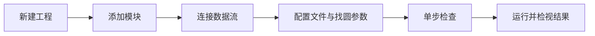

# DeepLux 快速上手：创建找圆流程

本指南用一个最小闭环说明基本操作：从文件加载图像，检测圆形目标，并在主视图和检查器中查看结果。

## 前置条件

已完成根目录 [README](../README.md) 中的构建、插件同步和 GUI 启动步骤。首次启动后，工具栏应能看到“图像处理”“检测识别”等分类；如果分类为空，先重新执行：

```bash
cmake --build build --target sync-plugins
```

## 操作步骤



### 1. 新建工程

在顶部工具栏选择“新建”。工程创建后，中央工作区默认显示**流程**页，左侧显示可用插件分类。

### 2. 添加模块

在工具栏中添加以下模块到流程画布：

1. `GrabImage`（加载图像）
2. `FindCircle`（找圆）
3. 一个显示或结果输出模块，例如 `ShowImage` 或 `SaveData`

可通过拖拽或工具箱提供的添加操作放置模块。模块在画布中的连线方向就是数据流方向。

### 3. 连接并配置

按 `GrabImage → FindCircle → 输出模块` 连接节点。选中节点后，右侧**检查器**显示参数和结果页。

对 `GrabImage`：

- 将**图像源**设为“文件”。
- 在**文件路径**选择一张包含清晰圆形边缘的 `png`、`jpg`、`bmp`、`tif` 或 `tiff` 图像。

对 `FindCircle`：

- 将**最小半径**和**最大半径**收敛到目标圆的合理范围。
- 使用**Canny 高阈值**控制边缘提取强度。
- 使用**累加器阈值**控制候选圆的筛选严格程度。

检查器中的“应用”会把当前输入写回该模块实例。若需要专用操作，可打开模块的高级配置；两种入口都针对同一个实例参数。

### 4. 单步检查

点击顶部或流程页的“单步”。每次操作只执行一个节点：

1. 第一步确认图像已显示在主视图。
2. 第二步确认找圆节点高亮，并在主视图出现圆形叠加。
3. 选择找圆节点，在检查器的**结果**页查看圆心 X/Y、半径和得分。

节点右侧的时间显示该节点最近一次执行耗时。单步仅在用户显式点击时触发，因此不会给循环运行增加逐节点停顿。

### 5. 运行与保存

- **运行**：完整执行当前工程一次。
- **循环**：连续执行，适用于在线采集；确认上游输入可重复提供数据后再使用。
- **停止**：终止当前运行或循环。

完成验证后，通过“保存”写入工程。需要保存检测数据时，将 `SaveData` 连接到流程末端并设置目标文件路径。

## 常见问题

| 现象 | 检查项 |
| --- | --- |
| 工具栏没有插件 | 重新构建并执行 `sync-plugins`；确认 `~/.deeplux/plugins` 可写。 |
| 图像未显示 | 确认 `GrabImage` 的图像源为“文件”、路径存在且格式受支持。 |
| 找圆结果为空或不稳定 | 缩小半径范围；检查图像对比度；再调整 Canny 高阈值和累加器阈值。 |
| 运行后难以定位问题 | 使用“单步”，在每步后检查主视图、检查器和底部运行日志。 |
| 参数改动未生效 | 在检查器中点击“应用”；保存工程前重新运行一次确认结果。 |

## 下一步

- 使用预处理、测量、逻辑和通信插件扩展流程。
- 打开底部“Agent 对话”，让 Agent 基于当前工程建议或创建流程；写操作仍需遵循权限和确认策略。
- 从顶部“快速标注”启用 SAM 标注，在主视图中创建掩膜并导出标注数据。

有关模块边界和运行时职责，请继续阅读 [架构说明](architecture.md)。
