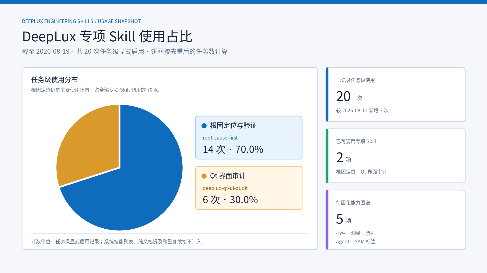

# DeepLux 专项 Skill 使用统计

> 统计截至 2026-08-19。

## 统计口径

- **统计对象**：当前已具备可执行工作流的项目专项 skill：`deeplux-qt-ui-audit`、`root-cause-first`。
- **计数单位**：去重后的任务级显式启用记录。仅当会话中明确将 skill 用于实际审计或问题定位时计 1 次；不计系统技能列表、安装说明、文档提及和仅讨论的后续计划。
- **证据范围**：可读取、且工作目录为 `/home/charles/Data/Repo/DeepLux` 的历史会话记录。重叠的会话续接内容已按任务去重。
- **限制**：这不是遥测数据。未被持久化或没有显式标注的调用不会出现在统计中。

| 可执行专项 skill | 已记录任务级使用 | 占比 | 主要落点 |
| --- | ---: | ---: | --- |
| `root-cause-first` | 14 | 70.0% | 崩溃、配置链路、运行引擎、SAM 后端与输入事件定位 |
| `deeplux-qt-ui-audit` | 6 | 30.0% | 主窗口与子窗口主题、布局、交互状态和截图验收 |
| **合计** | **20** | **100%** | 以问题修复与界面质量保障为主 |

## 解读

根因定位的使用量是界面审计的 2.33 倍，说明项目当前仍以稳定性、配置一致性和跨层交互修复为主要投入。界面审计已覆盖主题同步、主界面改版和真实 GUI 截图验收，但还没有形成按版本固定执行的验收门禁。

相较 2026-08-12 的快照新增 3 次 `root-cause-first`：工程契约修正的调用链核查、断点状态机修复，以及 D2 显式控制图循环修复。同期没有新增可追溯的 `deeplux-qt-ui-audit` 任务。

`插件交付`、`2D/3D 几何测量`、`流程执行与检视`、`Agent 受控协作`、`SAM 快速标注`五项目前仅作为能力图谱记录在 [技能总览](README.md)，尚未固化为可调用 skill，因而不计入使用次数。
